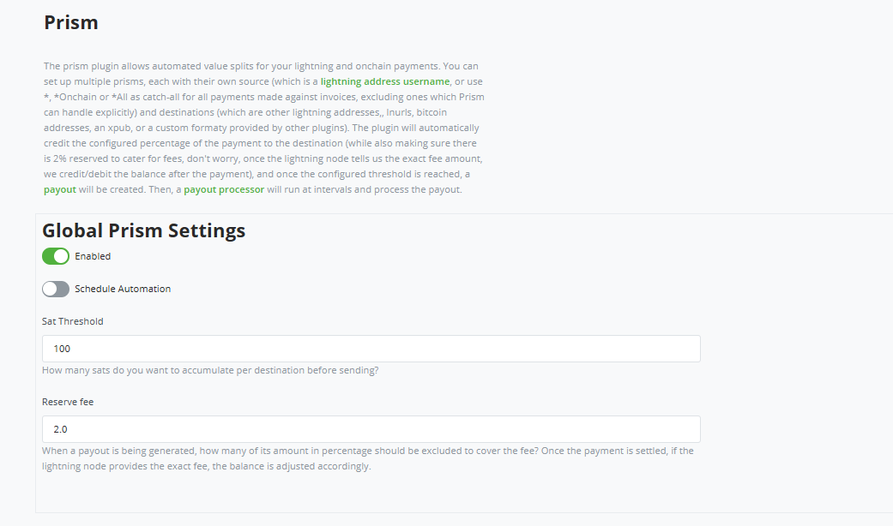
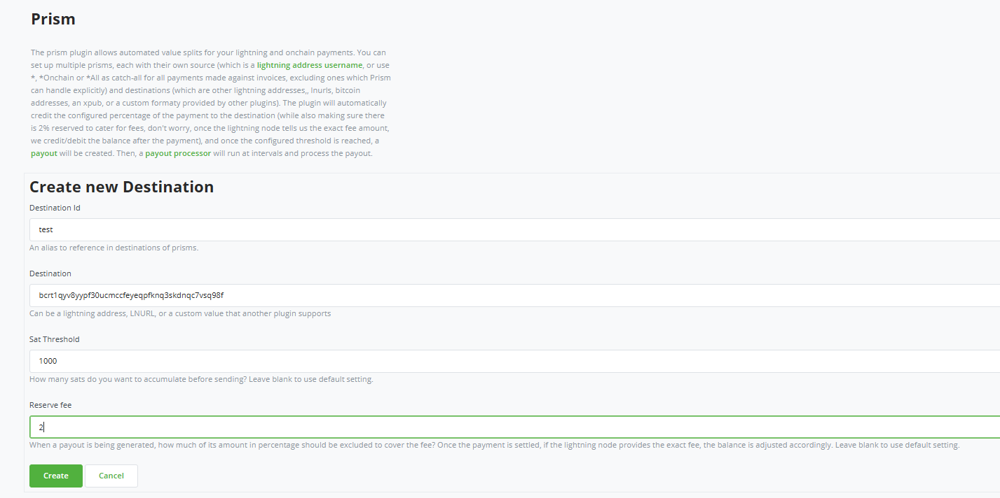
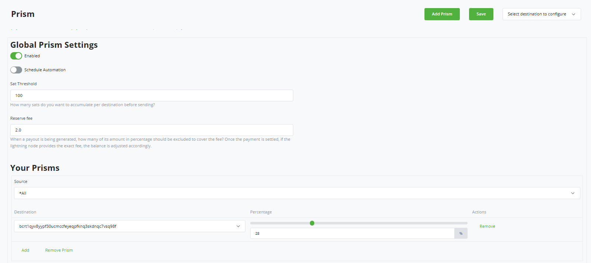
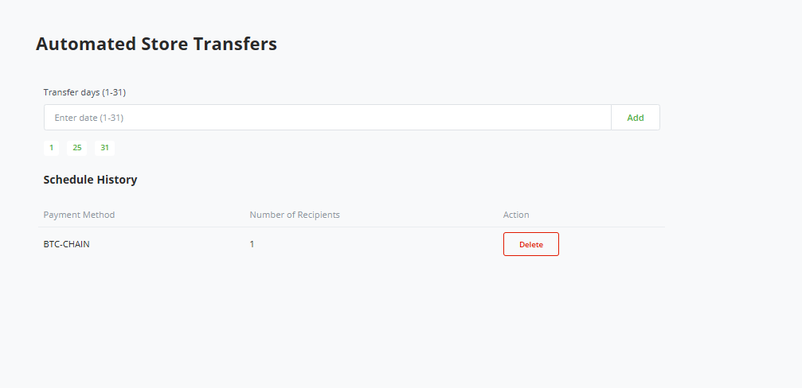
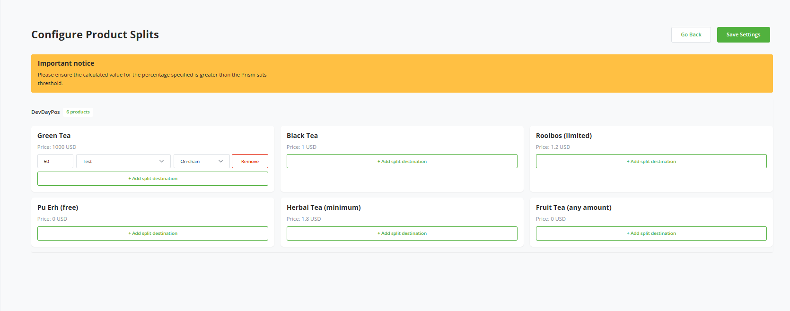
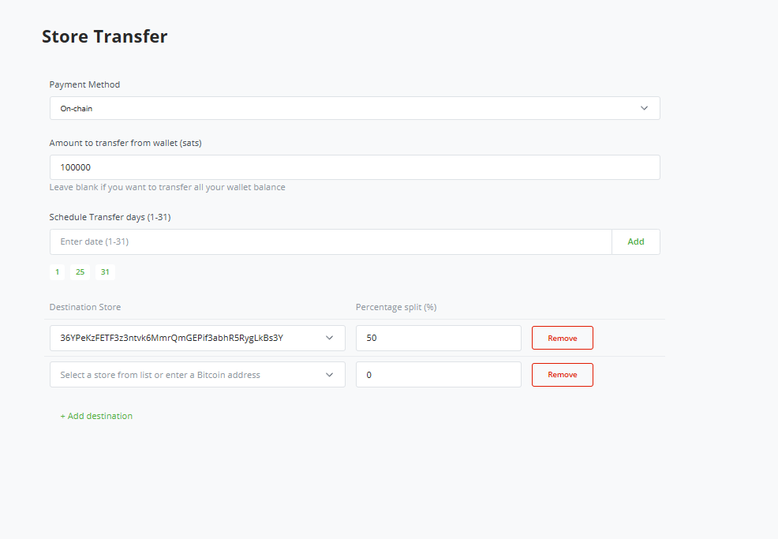

# BTCPay Server Prism Plugin

The Prism Plugin automates the way BTCPay Server invoice payments are split and distributed. Whenever a BTCPay invoice is paid, Prism can take that payment and divide it across multiple destinations according to your configuration.

You can create different `prisms`, each tied to a payment source and one or more destinations. Sources can be:

- *  => for Lightning payments
	
- *CHAIN =>  for on-chain payments

- *All => for both on-chain and lightning payments

## What Prism Offers

Prism gives BTCPay merchants and users flexibility to manage and automate how Bitcoin payments are allocated.

- Splits from Invoice Payments: Automatically split funds from invoices paid via Lightning or on-chain Bitcoin transactions.

- PoS Item splits: Define splits for individual items in Point-of-Sale (PoS) items. This is good for revenue sharing, commisions, e.t.c.

- Store-to-store transfer: Route payments from one of your stores to another within the same BTCPay Server. You can also route payment to onchain addresses. This is ideal for merchants managing multiple stores. Transfers can be setup in two ways:
	
    1.  One-Time Transfer: Perform an immediate split payment from the current store to other stores or Bitcoin addresses. Percentage cut can be customized per destination. 
	
	2. Schedule Transfer: Set up recurring transfers (e.g., every first or last day of the month). This is particularly useful for automating monthly settlements between stores.

## Setup Prism plugin

1. Login to your BTCPay Server instance, In the left navigation section, click on `Manage Plugins`. Search for `Prism`, and click install. Restart the BTCPay Server when prompted.

2. Prism requires configured payout processors. To configure one,  go to `Store settings` > `Payout Processors` and configure your preferred processor (if not already set up).

3. Now you are all set up. On the left navigation menu select `Prism`, `Enabled` must be toggled on to use Prism. If you plan to use the schedule/recurring transfers, you should toggle on `Schedule Automation`.

There are two more configuration in the Global Prism Settings:

Sats Threshold: Minimum amount (in sats) that can be processed per payout. The default is 100 sats.

Reserve Fee: This represent percentage of payout reserved for fees. Default for this is 2% and can also be adjusted.

4. To split invoice payment, you can start off with creating a new destination. On the top right of the Prism page, select `Select destination to configure` > `Create new destination`. Fill in the destination details, including sats threshold and reserve fee if you want to override the global settings for this particular destination. 

Once you are done configuring your destinations, you can click on `Add prism` at the top right of the prism page.

Select source, which represents which invoice payment you want to split, in our case is either On-Chain, lightning payments or both. You can configure your destination also, setting the percentage of the invoice payment received for the source selected that should be split. 

 You can use multiple prisms, especially if you want to target different sources. If you are targeting the same source you can just work with a single prism and add one or more destinations depending on choice. Once done click Save. Any payment you receive on any invoice would be split amongst the destination based on your configuration as long as the global prism setting is enabled, and the amount is at least equal to the sats threshold.

 

5. For store transfers and PoS splits, on the left navigation menu, select `Auto Transfer` which is directly under `Prism`.

For store transfer, in the `Auto Transfer` page you can define the days of the month for which you want to auto-process store payments. Once included, click `Save Settings` to save your schedule. Please ensure that the `Schedule Automation` is toggled on, as without this, recurring payment would not occur. If you choose to pause recurring payments, you can toggle it off.

6. To configure PoS split, still in the `Auto Transfer` page, click `Options` > `Configure POS products`. This split requires a PoS app set to Product List or Product List with Cart style.

You can configure splits for individual PoS items, specifying destination stores and how many percent of the items purchased goes to each of the destination stores.

7. If you want to implement store transfers (one time or recurring), on the `Auto Transfer` page, click `Options` > `Send now`. On the Store Transfer page, select the payment method of choice, how much you want to send, enter the destination for the transfer. You can enter multiple destinations and split an amount amongst all destinations.

If you want the payment to be recurring, you can enter the day(s) of the month that you want the payment to be sent. However if you prefer one time payment, you can leave this empty and if there are any pre-populated day(s), you can click the day to remove. 

Click on `Save Transfers` and your transfer would be processed (if one time) or saved and processed later (if scheduled). 

In the Prism page, you can see all your pending payouts. 

Note: New transfers won’t process if there are pending payouts. This is especially important when scheduling store transfers.

## Support and community

BTCPay Server is built and maintained entirely by contributors around the internet. We welcome and appreciate new contributions.

Do you notice any errors or bug? are you having issues with using the plugin? would you like to request a feature? please [create an issue](https://github.com/Kukks/BTCPayServerPlugins/issues/new)

Feel free to join our support channel over at [https://chat.btcpayserver.org/](https://chat.btcpayserver.org/) or [https://t.me/btcpayserver](https://t.me/btcpayserver) if you need help or have any further questions.
